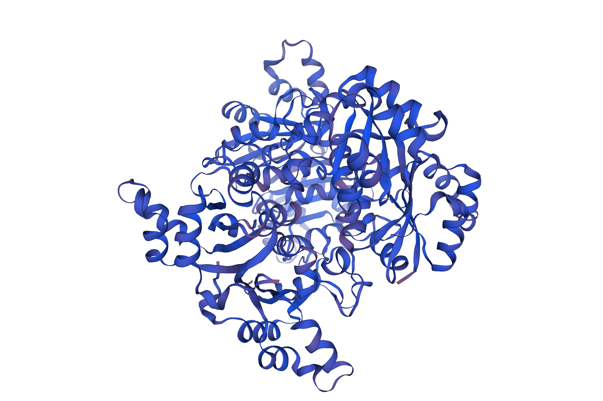
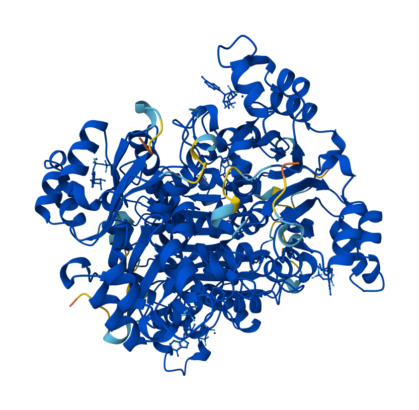

# Analýza proteinu NDK4 (Nucleoside diphosphate kinase D)

Tento repozitář obsahuje zápočtový projekt z předmětu "Databáze a počítačové nástroje v biochemickém výzkumu" (Seminář oboru I - biochemická část). Cílem projektu byla komplexní bioinformatická analýza zadané proteinové sekvence pomocí dostupných databází a predikčních nástrojů.

## Cíle projektu
* **Identifikace proteinu:** Určení typu proteinu a jeho enzymové aktivity.
* **Evoluční analýza:** Vyhledání homologů napříč taxonomickými skupinami (savci, ptáci, ryby, bezobratlí, rostliny, houby, bakterie), vícenásobné sekvenční zarovnání (MSA) a definice konzervovaného motivu ve formátu PROSITE.
* **Buněčná lokalizace:** Detekce signálních sekvencí a predikce subcelulární lokalizace.
* **Strukturní analýza:** Predikce sekundární struktury a modelování 3D struktury.
* **Membránová interakce:** Analýza hydrofobního profilu a topologie.
* **Posttranslační modifikace (PTM):** Predikce fosforylačních míst (seriny) a návrh experimentálního ověření pomocí LC-MS/MS.

## Použité nástroje a databáze
* **Identifikace a homology:** BLASTp (NCBI), UniProtKB/Swiss-Prot
* **Sekvenční zarovnání a motivy:** Clustal Omega, ESPript 3.2, ScanProsite
* **Lokalizace a signální sekvence:** TargetP 2.0, DeepLoc 2.0
* **Sekundární struktura:** NPS@ (DSC, GOR4, Predator), PSIPRED, JPred4
* **3D modelování a vizualizace:** Swiss-Model, AlphaFold 3, PyMOL
* **Membránová interakce:** ProtScale, TOPCONS
* **Predikce fosforylace:** NetPhos 3.1

### 3D Modely proteinu
**Model vytvořený ve Swiss-Model:**

**Model z AlphaFold 3:**

**Superpozice modelů (PyMOL):**

## Obsah repozitáře
* `protein_projekt_2.pdf` - Vypracovaná zápočtová práce s detailními výsledky a grafickými výstupy.
* `protein_projekt_2_zadani.pdf` - Zadání zápočtové práce.
* `protein_projekt_2_alingment_sekvence.txt` - FASTA sekvence použité pro vícenásobné zarovnání.
* `protein_projekt_2_zraly.txt` - FASTA sekvence zralého proteinu (bez odštěpeného signálního peptidu).
* Obrazové soubory (`.png`, `.jpg`) - Grafické výstupy z programů PSIPRED, DeepLoc, Swiss-Model, AlphaFold a PyMOL.

## Autoři
* Marie Kličková
* Karolína Šustrová
